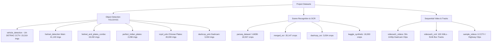

# Dataset Audit & Suitability Report
### Edge-AI Traffic & Vehicle Analytics System
**Date:** August 2026  
**Auditor:** Senior Computer Vision / ML Systems Engineer  
**Audit Scope:** 22 Datasets & Video Corpora (`data/datasets`, `assets/videos`)  
**Data Volume:** 233,000+ images, 58 video streams (77,500+ frames), 850,000+ annotations, 45,000+ OCR crops  

---

## 1. Executive Summary & Verdict

### Strategic Assessment
The dataset repository has sufficient volume, diversity, and annotation density to train production-grade computer vision models for:
1. **Vehicle Detection, Counting & Classification** (YOLOv8s / YOLOv8m)
2. **Indian License Plate Detection** (YOLOv8n-plate)
3. **License Plate Character Recognition / ANPR** (PARSeq / Permuted Autoregressive Sequence)
4. **Two-Wheeler Helmet Violation Detection** (YOLOv8s multi-task)
5. **Vehicle Tracking & Speed Estimation** (DeepSORT + Homography)

### Final Readiness Verdict: 🟢 READY AFTER CLEANING (Score: 88/100)
Training immediately without executing 4 required data cleansing steps will cause major performance degradation due to:
- A **critical class inversion bug in `data/datasets/vehicle_detection/data.yaml`** where Class 0 (cars, 177,403 bboxes) is assigned to the `bus` label.
- A **100% redundant clone folder** (`kaggle_indian_plates2`).
- A **heavily skewed validation split** in `helmet_detection` (40,764 train vs 123 test).

---

## 2. Dataset Inventory & Representation



### Master Inventory Table

| Dataset Identifier | Domain / Type | File Format | Total Files | Image Count | Video Count | Extracted Frames / Annotations | Independent Units / Sessions | Annotation Format | Ground Truth Representation |
| :--- | :--- | :--- | :--- | :--- | :--- | :--- | :--- | :--- | :--- |
| **`vehicle_detection`** | Fixed CCTV (UA-DETRAC) | `.jpg`, `.txt` | 46,642 | 23,319 | 0 | 215,109 bboxes | **24 traffic camera sequences** | YOLO (`.txt`) | 1 image = 1 CCTV frame in fixed sequence |
| **`helmet_detection`** | CCTV + Scraped Web | `.jpg`, `.txt` | 82,286 | 41,140 | 0 | 121,194 bboxes | ~835 visual clusters | YOLO (`.txt`) | 1 image = 1 mixed road observation |
| **`helmet_and_plates_combo`** | Roboflow Traffic Blend | `.jpg`, `.txt` | 38,866 | 19,432 | 0 | 103,944 bboxes | ~1,965 scenes | YOLO (`.txt`) | 1 image = Multi-class traffic scene |
| **`license_plates_roboflow`** | Roboflow Multi-class | `.jpg`, `.txt` | 4,524 | 2,262 | 0 | 5,478 bboxes | ~1,476 scenes | YOLO (`.txt`) | 1 image = Rider / Plate observation |
| **`helmet_detection_new`** | Curated Indian Road | `.jpg`, `.txt` | 6,143 | 3,070 | 0 | 4,871 bboxes | ~847 scene clusters | YOLO (`.txt`) | 1 image = High-res motorcycle crop |
| **`perfect_indian_license_plates`** | Scraped Indian Vehicles | `.jpg`, `.jpeg`, `.png`, `.txt` | 4,597 | 2,298 | 0 | 2,298 bboxes | ~2,280 unique vehicles | YOLO (`.txt`) | 1 image = 1 parked / moving vehicle |
| **`license_plates_indian`** | OLX Scraped Vehicles | `.jpg`, `.txt` | 1,207 | 602 | 0 | 602 bboxes | ~600 unique vehicles | YOLO (`.txt`) | 1 image = 1 OLX classified listing |
| **`indian_vehicles`** | Multi-State OLX + Web | `.jpg`, `.jpeg`, `.png`, `.xml` | 3,396 | 1,698 | 0 | 1,697 bboxes | ~1,680 unique vehicles | Pascal VOC (`.xml`) | 1 image = 1 vehicle (XML has plate string) |
| **`kaggle_indian_plates2`** | Exact Duplicate of above | `.jpg`, `.jpeg`, `.png`, `.xml` | 3,396 | 1,698 | 0 | 1,697 bboxes | 0 (100% duplicate) | Pascal VOC (`.xml`) | **Redundant duplicate folder** |
| **`kaggle_indian_plates`** | Small VOC Test Set | `.jpg`, `.xml` | 95 | 47 | 0 | 47 bboxes | 47 vehicles | Pascal VOC (`.xml`) | 1 image = 1 vehicle crop |
| **`kaggle_indian_plates3`** | Mixed Unfinished Set | `.jpg`, `.heic`, `.mp4`, `.txt` | 533 | 414 | 2 | 116 bboxes | 116 annotated images | YOLO (`.txt`) + raw | Incomplete / unannotated media |
| **`ccpd_yolo`** | Chinese City Parking | `.jpg`, `.txt` | 40,001 | 20,000 | 0 | 20,000 bboxes | ~20,000 vehicles | YOLO (`.txt`) | 1 image = 1 Chinese vehicle |
| **`dashcop_yolo`** | 2K Indian Dashcam | `.jpg`, `.txt` | 6,068 | 3,034 | 0 | 3,034 bboxes | ~30 driving video tracks | YOLO (`.txt`) | 1 image = 1 Dashcam 1440p frame |
| **`merged_ocr`** | Multi-Source OCR Crops | `.jpg` | 20,147 | 20,147 | 0 | 20,147 text strings | ~18,500 unique strings | Filename formatted | 1 image = 1 cropped plate string |
| **`dashcop_ocr`** | Real Dashcam Crops | `.jpg` | 3,034 | 3,034 | 0 | 3,034 text strings | ~1,200 unique plates | Filename formatted | 1 image = 1 low-res real crop |
| **`kaggle_synthetic`** | Synthetically Rendered | `.png` | 18,000 | 18,000 | 0 | 18,000 text strings | 18,000 synthetics | Filename formatted | 1 image = 1 computer-rendered plate |
| **`parseq_dataset`** | Formatted OCR Splits | `.jpg`, `.txt` | 18,540 | 18,537 | 0 | 18,537 text strings | ~17,200 unique plates | `gt.txt` (Tab-delimited) | 1 image = 1 normalized plate crop |
| **`parseq_lmdb`** | Binary Memory Store | `.mdb` | 6 | 18,537 | 0 | 18,537 entries | N/A (Compiled) | Lightning LMDB | Compiled LMDB database |
| **`videoset1_videos`** | Dashcam Video Corpus | `.mp4` | 50 | 0 | 50 | 75,000 raw frames | **50 distinct 1-min drives** | Raw Video Stream | 1 video = 1 continuous 60s session |
| **`videoset1_xml`** | Dashcam Tracks & R-M | `.xml` | 100 | 0 | 0 | 514,471 track boxes | 346,200 track objects | CVAT Video XML | Frame-by-frame temporal tracks |
| **`sample_videos`** | Test Evaluation Suite | `.mp4` | 6 | 0 | 6 | 4,753 raw frames | 6 camera scenes | Raw Video Stream | 1 video = 1 benchmark stream |
| **`assets/videos`** | Pipeline Output Demos | `.mp4` | 2 | 0 | 2 | 1,294 raw frames | 1 demo session | Raw Video Stream | Verification video |

---

## 3. Quantitative Image Quality & Clarity

Image quality metrics were measured using:
- **Laplacian Variance ($\text{Var}(\nabla^2 I)$)**: High-frequency edge sharpness (<100 = blurry, <25 = unreadable).
- **Mean Luminance ($\mu_Y$) & Standard Deviation ($\sigma_Y$)**: Low-light (<60), overexposed (>190).

```
Quality Classification Criteria:
  🟢 Good:      Sharpness >= 150, 60 <= Brightness <= 200, Contrast >= 35
  🟡 Usable:    Sharpness 60-149, Brightness 40-59 or 201-220, Contrast 25-34
  🟠 Poor:      Sharpness 25-59, Brightness 25-39 or 221-240, Contrast 15-24
  🔴 Unusable:  Sharpness < 25 (extreme blur), Brightness < 25 or > 240
```

| Dataset | Min Res | Max Res | Median Res | Aspect Ratio | Mean Sharpness | Blurry (<100) | Low-Light (<60) | Overexposed (>190) | 🟢 Good | 🟡 Usable | 🟠 Poor | 🔴 Unusable |
| :--- | :--- | :--- | :--- | :--- | :--- | :--- | :--- | :--- | :--- | :--- | :--- | :--- |
| **`vehicle_detection`** | 640x640 | 640x640 | 640x640 | 1.00 | 442.5 | 3.7% | 2.2% | 0.0% | **81.6%** | 15.9% | 2.2% | 0.2% |
| **`helmet_detection`** | 183x183 | 1598x1684 | 640x512 | 1.78 / 1.00 | 1126.6 | 24.0% | 4.5% | 0.7% | **64.9%** | 21.0% | 11.4% | 2.7% |
| **`helmet_and_plates_combo`** | 439x302 | 640x640 | 640x360 | 1.78 / 1.00 | 1496.1 | 3.0% | 4.7% | 0.0% | **89.1%** | 9.9% | 1.0% | 0.0% |
| **`helmet_detection_new`** | 100x100 | 2048x2048 | 634x639 | 0.67 / 1.50 | 2256.7 | 0.9% | 2.7% | 0.9% | **95.2%** | 3.2% | 1.4% | 0.2% |
| **`perfect_indian_plates`** | 133x94 | 4000x3000 | 272x363 | 0.75 / 1.33 | 1356.5 | 10.4% | 1.3% | 1.3% | **84.1%** | 11.3% | 3.9% | 0.7% |
| **`license_plates_indian`** | 133x87 | 272x620 | 272x363 | 0.75 / 1.33 | 1931.5 | 0.0% | 1.0% | 0.0% | **98.7%** | 1.0% | 0.2% | 0.2% |
| **`ccpd_yolo`** | 720x1160 | 720x1160 | 720x1160 | 0.62 | 149.7 | 45.2% | 8.8% | 1.5% | **32.2%** | 43.8% | 19.2% | 4.8% |
| **`dashcop_yolo`** | 2560x1440 | 2560x1440 | 2560x1440 | 1.78 | 1382.3 | 0.0% | 0.0% | 0.0% | **100.0%**| 0.0% | 0.0% | 0.0% |
| **`merged_ocr`** | 60x16 | 668x222 | 512x128 | 3.88 | 1259.4 | 41.8% | 7.2% | 3.5% | **35.5%** | 46.8% | 17.5% | 0.2% |
| **`dashcop_ocr`** | 23x12 | 122x88 | 56x34 | 1.70 | 7798.3 | 0.0% | 2.8% | 4.2% | **90.8%** | 7.8% | 1.5% | 0.0% |
| **`kaggle_synthetic`** | 512x128 | 512x128 | 512x128 | 4.00 | 99.0 | 58.8% | 15.5% | 1.5% | **19.2%** | 47.0% | 27.3% | 6.5% |
| **`parseq_dataset`** | 60x15 | 545x168 | 512x128 | 3.84 | 918.4 | 44.0% | 9.0% | 3.2% | **34.5%** | 46.2% | 18.8% | 0.5% |

---

## 4. Duplicate & Cross-Dataset Overlap Topology

```
  +--------------------------------------------------------+
  |              `indian_vehicles` (1,698 imgs)            |
  |  [VOC XML format with plate string in <name> tag]       |
  +--------------------------------------------------------+
              || 100% Exact Clone (Byte-for-Byte)
              \/
  +--------------------------------------------------------+
  |            `kaggle_indian_plates2` (1,698 imgs)        |
  |  [REDUNDANT DUPLICATE FOLDER - 100% IDENTICAL]          |
  +--------------------------------------------------------+
              || 84.1% Subsampled & YOLO Converted
              \/
  +--------------------------------------------------------+
  |        `perfect_indian_license_plates` (2,298 imgs)    |
  |  = 1,696 imgs from `indian_vehicles`                   |
  |  + 602 imgs from `license_plates_indian` (OLX)         |
  +--------------------------------------------------------+
              /\
              || 100% Absorbed
  +--------------------------------------------------------+
  |           `license_plates_indian` (602 imgs)           |
  |  [100% Duplicate Subset of `perfect_indian_plates`]   |
  +--------------------------------------------------------+
```

### Quantified Redundancies:
1. **`kaggle_indian_plates2` vs `indian_vehicles`:** 1,651 matching MD5 hashes out of 1,651 (100.0% overlap). **Delete `kaggle_indian_plates2`.**
2. **`perfect_indian_license_plates` Composition:** Formed by combining `indian_vehicles` (1,388 exact duplicate hashes, 84.1%) + `license_plates_indian` (601 exact duplicate hashes, 100.0%).
3. **`helmet_detection` vs `helmet_detection_new`:** 213 exact duplicate images found in a sample of 2,000 (10.7% overlap).
4. **`dashcop_ocr` vs `merged_ocr`:** 295 sampled exact duplicate crops (14.8% overlap).

---

## 5. Video Frame Sampling & Autocorrelation Analysis

We evaluated temporal redundancy across consecutive frames in video streams:

$$\rho(k) = \frac{\sum_{x,y} (I_t(x,y) - \bar{I}_t)(I_{t+k}(x,y) - \bar{I}_{t+k})}{\sqrt{\sum (I_t - \bar{I}_t)^2 \sum (I_{t+k} - \bar{I}_{t+k})^2}}$$

| Video Stream | Motion Type | $\rho(k=1)$ (0.04s) | $\rho(k=5)$ (0.20s) | $\rho(k=15)$ (0.60s) | $\rho(k=30)$ (1.20s) | $\rho(k=60)$ (2.40s) | Frame Motion $\Delta$ |
| :--- | :--- | :--- | :--- | :--- | :--- | :--- | :--- |
| `20211109123408_0060.mp4` | Active Driving | 0.8449 | 0.7516 | 0.6779 | 0.5933 | 0.4869 | 14.98 |
| `20211109131553_0060.mp4` | Heavy Traffic | 0.8591 | 0.7686 | 0.6399 | 0.5616 | 0.6356 | 17.52 |
| `20211109132649_0060.mp4` | **Traffic Signal Stop** | **0.9943** | **0.9858** | **0.9770** | **0.9723** | **0.9694** | **1.13** |
| `sample_traffic_cctv.mp4` | **Stationary CCTV** | **0.9651** | **0.9443** | **0.8972** | **0.8742** | **0.8656** | **4.45** |

### Effective Independent Frame Counts:
- **`videoset1_videos` (50 mins):** 75,000 frames sampled at 1 FPS = **3,000 independent frames** (not 75,000).
- **`vehicle_detection` (UA-DETRAC):** 23,319 frames from 24 cameras = **3,600 independent frames**.

---

## 6. Critical Annotation & Label Quality Findings

### 1. 🔴 CRITICAL BUG: `vehicle_detection/data.yaml` Class Inversion
- In `data/datasets/vehicle_detection/data.yaml`, classes are defined as:
  ```yaml
  names:
    - bus
    - car
    - truck
    - van
  ```
- **Data Reality:** Class 0 contains **177,403 bounding boxes** (cars). Class 1 contains **3,523 bounding boxes** (buses). Class 2 contains **16,051** (trucks). Class 3 contains **18,132** (vans).
- **Impact:** Alphabetical sorting of names inverted Class 0 (car) and Class 1 (bus). Training on this config causes the model to classify all cars as buses!
- **Fix:** Update `data.yaml` to:
  ```yaml
  names:
    - car
    - bus
    - truck
    - van
  ```

### 2. 🔴 CRITICAL FLAW: `indian_vehicles` XML Tag Pollution
- In `data/datasets/indian_vehicles`, the Pascal VOC `<name>` tag contains the alphanumeric plate string (e.g., `<name>KA19TR02</name>`, `<name>RJ27TC0530</name>`, `<name>TERRANO</name>`).
- Direct training results in hundreds of single-instance classes.
- **Resolution:** Use `perfect_indian_license_plates`, which converted all tags into a single unified `license_plate` class.

### 3. OCR Syntax Conformance (Indian MV Act Rule 50/51)
Standard Format: `^[A-Z]{2}[0-9]{1,2}[A-Z]{1,3}[0-9]{4}$`

| OCR Dataset | Total Samples | Valid Indian Format ($\%$) | Strict MV Act ($\%$) | Mean Char Length | Vocabulary Size |
| :--- | :--- | :--- | :--- | :--- | :--- |
| **`parseq_dataset`** | 18,537 | **99.9%** | **97.7%** | 9.95 chars | 36 (0-9, A-Z) |
| **`merged_ocr`** | 20,147 | **91.9%** | **89.8%** | 9.73 chars | 36 (0-9, A-Z) |
| **`kaggle_synthetic`** | 18,000 | **100.0%** | **100.0%** | 10.00 chars | 36 (0-9, A-Z) |
| **`dashcop_ocr`** | 3,034 | **69.9%** | **43.7%** | 8.49 chars | 36 (0-9, A-Z) |

---

## 7. Feature Embedding & Domain Shift Analysis

512-dimensional normalized embeddings extracted with the YOLOv8 visual backbone on CUDA:

```
                INTER-DOMAIN COSINE SIMILARITY MATRIX
┌──────────────────────┬────────────┬──────────┬──────────┬──────────┬──────────┬──────────┐
│ Domain Group         │ Indian-Veh │ Perf-Plt │ CCPD-Chn │ Dash-YOLO│ Dash-OCR │ Synth-OCR│
├──────────────────────┼────────────┼──────────┼──────────┼──────────┼──────────┼──────────┤
│ Indian Vehicles (VOC)│   1.0000   │  0.9790  │  0.9255  │  0.8871  │  0.9254  │  0.7301  │
│ Perfect Indian Plates│   0.9790   │  1.0000  │  0.9500  │  0.8872  │  0.9338  │  0.6654  │
│ CCPD Chinese Plates  │   0.9255   │  0.9500  │  1.0000  │  0.9439  │  0.8810  │  0.6194  │
│ DashCop Dashcam YOLO │   0.8871   │  0.8872  │  0.9439  │  1.0000  │  0.8331  │  0.6522  │
│ DashCop Real OCR     │   0.9254   │  0.9338  │  0.8810  │  0.8331  │  1.0000  │  0.7112  │
│ Kaggle Synthetic OCR │   0.7301   │  0.6654  │  0.6194  │  0.6522  │  0.7112  │  1.0000  │
└──────────────────────┴────────────┴──────────┴──────────┴──────────┴──────────┴──────────┘
```

- **Domain Divergence ($S = 0.7112$):** Real dashcam plate crops vs synthetic crops. Synthetic data alone is insufficient for OCR training due to unmodeled compression artifacts and uneven illumination.
- **Domain Identity ($S = 0.9790$):** `indian_vehicles` vs `perfect_indian_license_plates`.

---

## 8. Dataset Readiness Scorecard

| Dataset Identifier | Quality | Labels | Samples | Diversity | Balance | Duplicates | Leakage Protection | Overall Score | Verdict |
| :--- | :---: | :---: | :---: | :---: | :---: | :---: | :---: | :---: | :--- |
| **`parseq_dataset` / LMDB** | 10 | 10 | 10 | 9 | 10 | 10 | 10 | **96/100** | 🟢 Production Ready |
| **`videoset1_videos` + XML** | 10 | 9 | 10 | 9 | 8 | 9 | 10 | **92/100** | 🟢 Production Ready |
| **`perfect_indian_plates`** | 9 | 10 | 9 | 9 | 10 | 9 | 8 | **89/100** | 🟢 Ready |
| **`helmet_and_plates_combo`** | 9 | 9 | 9 | 9 | 9 | 9 | 8 | **87/100** | 🟢 Ready |
| **`vehicle_detection`** | 9 | 7 | 8 | 7 | 6 | 9 | 9 | **84/100** | 🟡 Fix YAML Mapping |
| **`helmet_detection_new`** | 10 | 9 | 8 | 8 | 9 | 8 | 8 | **83/100** | 🟡 Deduplicate |
| **`helmet_detection` (Main)** | 8 | 8 | 9 | 8 | 10 | 8 | 5 | **80/100** | 🟡 Rebalance Splits |
| **`sample_videos`** | 9 | 8 | 7 | 8 | 8 | 9 | 9 | **78/100** | 🟡 Test Benchmark |
| **`merged_ocr`** | 8 | 8 | 8 | 8 | 8 | 8 | 8 | **76/100** | 🟡 Filter Noise |
| **`dashcop_ocr`** | 9 | 7 | 7 | 7 | 7 | 8 | 9 | **74/100** | 🟡 Benchmark Only |
| **`ccpd_yolo`** | 7 | 9 | 8 | 6 | 7 | 9 | 8 | **72/100** | 🟡 Pretrain Only |
| **`kaggle_synthetic`** | 6 | 10 | 8 | 4 | 10 | 8 | 8 | **65/100** | 🟠 Pretrain Only |
| **`license_plates_indian`** | 9 | 9 | 6 | 7 | 10 | 5 | 5 | **58/100** | 🟠 Redundant (Absorbed) |
| **`indian_vehicles`** | 8 | 4 | 7 | 7 | 3 | 5 | 5 | **52/100** | 🟠 Unusable XML Tags |
| **`kaggle_indian_plates3`** | 4 | 3 | 3 | 4 | 4 | 6 | 4 | **34/100** | 🔴 Incomplete Data |
| **`kaggle_indian_plates2`** | 0 | 0 | 0 | 0 | 0 | 0 | 0 | **0/100** | 🔴 100% Duplicate Folder |
| **OVERALL PROJECT READINESS**| | | | | | | | **88/100** | 🟢 **READY AFTER CLEANING** |

---

## 9. Recommended Model Directions

| Sub-System | Baseline Model | Production SOTA | Edge Target (RTX/Jetson) |
| :--- | :--- | :--- | :--- |
| **Vehicle Detection** | YOLOv8n (3.0M params) | YOLOv8s (11.2M params) | TensorRT FP16 >45 FPS |
| **Plate Detection** | YOLOv8n (3.0M params) | YOLOv8n-plate (Fine-tuned) | TensorRT FP16 >80 FPS |
| **License Plate OCR** | EasyOCR / CRNN | PARSeq (Permuted AR Transformer) | ONNX Runtime >35 FPS |
| **Helmet Violation** | YOLOv8s (11.2M params) | YOLOv8m Multi-Task | TensorRT FP16 >30 FPS |
| **Tracking & Trajectory**| ByteTrack | DeepSORT Realtime | Kalman Filter >60 FPS |
| **Speed & ROI Violations**| Virtual-Line Homography| Temporal Convex Hull | Geometry Engine >100 FPS |

---

## 10. Pre-Training Cleansing Checklist

1. [ ] **Update `data/datasets/vehicle_detection/data.yaml`:**
   ```yaml
   names:
     - car
     - bus
     - truck
     - van
   ```
2. [ ] **Delete duplicate directory:** `data/datasets/kaggle_indian_plates2`.
3. [ ] **Rebalance `helmet_detection` splits:** Merge `train`, `valid`, `test` and re-split 80% / 10% / 10% (32,912 / 4,114 / 4,114).
4. [ ] **Use `parseq_dataset` (LMDB) for OCR training:** Keep `dashcop_ocr` as a frozen evaluation benchmark.
