# Comprehensive Dataset Catalog & Engineering Handbook
### Edge-AI Traffic & Vehicle Analytics System
**Document Version:** 2.0 (Post-Audit & Cleansing)  
**System Scope:** Vehicle Detection, Helmet Violation, ANPR/OCR, Multi-Object Tracking & Speed Estimation  
**Location:** `c:/projects/traffic-analytics-system/data/datasets`  

---

## 1. System Architecture & Dataset Mapping

The system utilizes modular, specialized deep learning models. The diagram below illustrates how each curated dataset feeds into specific model training pipelines:

```mermaid
graph TD
    subgraph "Sub-System 1: Vehicle Detection & Counting"
        VD_Data["vehicle_detection (UA-DETRAC CCTV)<br/>23,319 images | 215,109 bboxes<br/>Classes: car, bus, truck, van"] --> M_VD["YOLOv8s Vehicle Detector"]
    end

    subgraph "Sub-System 2: Helmet Violation Detection"
        HD_Data["helmet_combined (Unified CCTV & Web)<br/>42,559 images | 126k+ bboxes<br/>Classes: helmet, no_helmet"] --> M_HD["YOLOv8s Helmet Detector"]
    end

    subgraph "Sub-System 3: License Plate Localization"
        PD_Pre["ccpd_yolo (Chinese Plates)<br/>20,000 images<br/>(Backbone Pretraining)"] --> M_PD["YOLOv8n-plate Detector"]
        PD_Comb["plate_detection_combined (Indian Plates)<br/>3,742 unique images<br/>Train: 2,993 | Val: 374 | Test: 375"] --> M_PD
        PD_Aug["augmented/plate_detection<br/>1,600 weather/camera crops"] --> M_PD
    end

    subgraph "Sub-System 4: License Plate Text Recognition (ANPR)"
        OCR_Synth["kaggle_synthetic (18k crops)<br/>(Synthetic Pretraining)"] --> M_OCR["PARSeq OCR Transformer"]
        OCR_Parseq["parseq_dataset / parseq_lmdb<br/>18,537 normalized crops<br/>(Indian Syntax Aligned)"] --> M_OCR
        OCR_Bench["dashcop_ocr (3,034 crops)<br/>(Frozen Real Benchmark)"] -.->|Evaluation Only| M_OCR
    end

    subgraph "Sub-System 5: Tracking & Speed Estimation"
        Vid_Data["videoset1_videos (50x 1440p MP4s)<br/>videoset1_xml (514k track boxes)<br/>sample_videos (6 benchmark clips)"] --> M_Track["DeepSORT + Homography Engine"]
    end
```



---

## 2. In-Depth Dataset Catalog

---

### 2.1 Vehicle Detection (`vehicle_detection`)

* **Primary ML Task:** Multi-Class Vehicle Detection, Counting & Classification.
* **Model Target:** YOLOv8s / YOLOv8m (`models/vehicle_detector.pt`).
* **Root Path:** [`data/datasets/vehicle_detection/`](file:///c:/projects/traffic-analytics-system/data/datasets/vehicle_detection)
* **Configuration:** [`data/datasets/vehicle_detection/data.yaml`](file:///c:/projects/traffic-analytics-system/data/datasets/vehicle_detection/data.yaml)

#### Dataset Statistics & Splits
| Split | Image Count | Total Bounding Boxes | Percentage |
| :--- | :--- | :--- | :--- |
| **Train** | 18,655 | 172,087 bboxes | 80.0% |
| **Valid** | 2,332 | 21,511 bboxes | 10.0% |
| **Test** | 2,332 | 21,511 bboxes | 10.0% |
| **Total** | **23,319** | **215,109 bboxes** | **100.0%** |

#### Class Distribution & Mapping (Bug Fixed)
* **Class 0 (`car`):** 177,403 bboxes (82.5%) — Sedans, hatchbacks, SUVs.
* **Class 1 (`bus`):** 3,523 bboxes (1.6%) — Transit buses, double-deckers.
* **Class 2 (`truck`):** 16,051 bboxes (7.5%) — Heavy commercial vehicles, container trucks.
* **Class 3 (`van`):** 18,132 bboxes (8.4%) — Minivans, delivery vans, utility vehicles.

#### Image & Camera Properties
* **Source:** UA-DETRAC Traffic Benchmark (Fixed elevated CCTV intersection cameras).
* **Resolution:** Normalized 640×640 px (native 960×540 px).
* **Sharpness / Clarity:** Mean Laplacian variance 442.5 (95.4% sharp and clear).
* **Lighting Conditions:** Daylight, overcast, twilight, night-time with headlights, wet road reflections.

#### Recommended Training Recipe
```bash
python scripts/train_models.py --task vehicle --model yolov8s.pt --epochs 100 --imgsz 640 --batch 32 --mosaic 1.0 --mixup 0.15 --hsv_h 0.015 --hsv_s 0.7 --hsv_v 0.4
```

---

### 2.2 Helmet Violation Detection (`helmet_combined`)

* **Primary ML Task:** Two-Wheeler Helmet Violation Detection & Enforcement.
* **Model Target:** YOLOv8s / YOLOv8m (`models/helmet_detector.pt`).
* **Root Path:** [`data/datasets/helmet_combined/`](file:///c:/projects/traffic-analytics-system/data/datasets/helmet_combined)
* **Configuration:** [`data/datasets/helmet_combined/data.yaml`](file:///c:/projects/traffic-analytics-system/data/datasets/helmet_combined/data.yaml)

#### Dataset Statistics & Splits (Deduplicated & Rebalanced)
| Split | Image Count | Bounding Boxes (Approx.) | Percentage | Train/Test Leakage |
| :--- | :--- | :--- | :--- | :--- |
| **Train** | 34,047 | ~100,800 bboxes | 80.0% | **0 hashes (0.0%)** |
| **Valid** | 4,255 | ~12,600 bboxes | 10.0% | **0 hashes (0.0%)** |
| **Test** | 4,257 | ~12,600 bboxes | 10.0% | **0 hashes (0.0%)** |
| **Total** | **42,559** | **~126,000 bboxes** | **100.0%** | **0 Leakage** |

#### Class Mapping
* **Class 0 (`helmet`):** Standard full-face, open-face, construction/half helmets worn by riders/passengers.
* **Class 1 (`no_helmet`):** Bare head, turbans, caps, or headscarves without safety helmets on two-wheelers.

#### Image & Camera Properties
* **Source:** Merged and deduplicated from `helmet_detection` and `helmet_detection_new`.
* **Resolution:** 640×512 to 1920×1080 px.
* **Diversity:** Urban Indian traffic, crowded intersections, varying angles (front, rear, side profile), pillion riders.

#### Recommended Training Recipe
```bash
python scripts/train_models.py --task helmet --model yolov8s.pt --epochs 120 --imgsz 640 --batch 32 --fl_gamma 1.5 --box 7.5 --cls 0.5
```

---

### 2.3 Indian License Plate Detection (`plate_detection_combined`)

* **Primary ML Task:** High-Precision License Plate Localization.
* **Model Target:** YOLOv8n-plate (`models/plate_detector.pt`).
* **Root Path:** [`data/datasets/plate_detection_combined/`](file:///c:/projects/traffic-analytics-system/data/datasets/plate_detection_combined)
* **Configuration:** [`data/datasets/plate_detection_combined/data.yaml`](file:///c:/projects/traffic-analytics-system/data/datasets/plate_detection_combined/data.yaml)

#### Dataset Statistics & Splits
| Split | Image Count | Percentage | Source Contribution |
| :--- | :--- | :--- | :--- |
| **Train** | 2,993 | 80.0% | Perfect Plates (1.8k) + DashCop (1.1k) + Rescued VOC (47) |
| **Valid** | 374 | 10.0% | Stratified Random |
| **Test** | 375 | 10.0% | Stratified Random |
| **Total** | **3,742** | **100.0%** | **Deduplicated Real Indian Vehicles** |

#### Class Mapping
* **Class 0 (`license_plate`):** Standard HSRP plates, yellow commercial plates, green EV plates, older embossed plates.

#### Image & Camera Properties
* **Resolution Range:** 272×363 px (scraped) up to 2560×1440 px (DashCop 2K footage).
* **Angles:** Rear plates (70%), front plates (30%), oblique angles up to 45°.

#### Recommended Training Recipe
```bash
python scripts/train_models.py --task plate --model yolov8n.pt --epochs 150 --imgsz 640 --batch 16 --scale 0.5 --perspective 0.001
```

---

### 2.4 Pretraining Plate Detection Corpus (`ccpd_yolo`)

* **Primary ML Task:** Generic Plate Feature Representation Pretraining.
* **Root Path:** [`data/datasets/ccpd_yolo/`](file:///c:/projects/traffic-analytics-system/data/datasets/ccpd_yolo)
* **Total Volume:** 20,000 images, 20,000 bboxes.
* **Format:** YOLO standard (`images/`, `labels/`).
* **Role:** Backbone warm-up. **Do not use in final fine-tuning** to avoid Chinese plate bias.

---

### 2.5 Normalized OCR Corpus & Binary LMDB (`parseq_dataset` / `parseq_lmdb`)

* **Primary ML Task:** License Plate Character Sequence Recognition (ANPR / OCR).
* **Model Target:** PARSeq (Permuted Autoregressive Sequence Transformer).
* **Root Path:** [`data/datasets/parseq_dataset/`](file:///c:/projects/traffic-analytics-system/data/datasets/parseq_dataset) & [`data/datasets/parseq_lmdb/`](file:///c:/projects/traffic-analytics-system/data/datasets/parseq_lmdb)

#### Dataset Statistics & Structure
| Split | Image Count (PNG/JPG) | LMDB Binary Entries | Character Syntax Conformance |
| :--- | :--- | :--- | :--- |
| **Train** | 15,756 crops | 15,756 records | **99.9% Indian format** (`DL01AB1234`) |
| **Val** | 1,854 crops | 1,854 records | **99.9% Indian format** |
| **Test** | 927 crops | 927 records | **99.9% Indian format** |
| **Total** | **18,537 crops** | **18,537 records** | **36-char Vocab (0-9, A-Z)** |

#### Crop Properties
* **Resolution:** Normalized 128×32 px / 512×128 px.
* **Aspect Ratio:** 3.84:1 (standard rectangular plate ratio).
* **Storage:** LMDB memory-mapped database for zero-disk-bottleneck GPU throughput.

#### Recommended Training Recipe
```bash
python scripts/train_parseq.py --data_dir data/datasets/parseq_lmdb --batch_size 256 --max_epochs 50 --lr 7e-4 --img_size 32 128
```

---

### 2.6 Real-World Out-of-Distribution OCR Benchmark (`dashcop_ocr`)

* **Primary ML Task:** Zero-Shot / Generalization Benchmark for ANPR.
* **Root Path:** [`data/datasets/dashcop_ocr/`](file:///c:/projects/traffic-analytics-system/data/datasets/dashcop_ocr)
* **Total Samples:** 3,034 tightly cropped plate images from 2K dashcam streams.
* **Ground Truth Format:** Filename-encoded text (e.g., `DL8CAX3888_001.jpg`).
* **Characteristics:** Extremely low resolution (median 56×34 px), motion blur, dust, angle distortions.
* **Role:** **FROZEN TEST BENCHMARK.** Never train or augment this dataset. Use exclusively to report real-world accuracy.

---

### 2.7 Synthetic OCR Diversity Corpus (`kaggle_synthetic`)

* **Primary ML Task:** Font Diversity & Rare RTO Code Pretraining.
* **Root Path:** [`data/datasets/kaggle_synthetic/`](file:///c:/projects/traffic-analytics-system/data/datasets/kaggle_synthetic)
* **Total Samples:** 18,000 generated plate crops.
* **Ground Truth:** Filename-encoded text covering all 36 Indian states and Union Territories (e.g., `AN`, `AP`, `AR`, `AS`, `BR`, `CG`, `CH`, `DL`, `GA`, `GJ`, `HR`, `HP`, `JH`, `JK`, `KA`, `KL`, `LA`, `LD`, `MH`, `ML`, `MN`, `MP`, `MZ`, `NL`, `OD`, `PB`, `PY`, `RJ`, `SK`, `TN`, `TR`, `TS`, `UK`, `UP`, `WB`).

---

### 2.8 High-Resolution Sequential Video Corpus (`videoset1_videos` + `videoset1_xml`)

* **Primary ML Task:** Multi-Object Tracking (DeepSORT), Trajectory Estimation, Virtual-Line Speed Estimation, Wrong-Way Driving Detection.
* **Root Paths:** [`data/datasets/videoset1_videos/`](file:///c:/projects/traffic-analytics-system/data/datasets/videoset1_videos) and [`data/datasets/videoset1_xml/`](file:///c:/projects/traffic-analytics-system/data/datasets/videoset1_xml)

#### Video Stream Specifications
* **Stream Count:** 50 continuous 1-minute video drives.
* **Resolution:** **2560×1440 px (2K QHD)**.
* **Framerate:** 25.000 FPS (Progressive).
* **Codec:** H.264 / AVC High Profile.
* **Total Frame Volume:** 75,000 frames.

#### CVAT Tracklet Annotations (`videoset1_xml`)
* **File Count:** 100 CVAT Video 1.1 XML files.
* **Track Bounding Boxes:** **514,471 annotated bounding boxes**.
* **Tracked Entities:** `rider`, `motorcycle`, `helmet`, `no_helmet`, `license_plate` (with OCR text attributes).
* **Temporal Continuity:** Every entity contains continuous ID tracking across consecutive frames.

---

### 2.9 Test Evaluation Video Suite (`sample_videos` & `assets/videos`)

* **Primary Task:** End-to-End Pipeline Integration & Benchmark Replay.
* **Paths:** [`data/datasets/sample_videos/`](file:///c:/projects/traffic-analytics-system/data/datasets/sample_videos) (6 clips) & [`assets/videos/`](file:///c:/projects/traffic-analytics-system/assets/videos) (2 clips).
* **Scenarios:** Stationary CCTV highway feed, city intersection traffic light, nighttime driving stream, heavy congestion.

---

## 3. Augmented Datasets Registry

All augmented data is isolated inside `data/datasets/augmented/` to guarantee zero corruption of baseline ground truth:

```
data/datasets/augmented/
└── plate_detection/                    <-- 1,600 camera/weather augmented crops
    ├── images/                         <-- Generated images (aug_*.jpg)
    ├── labels/                         <-- YOLO labels (aug_*.txt)
    └── data.yaml                       <-- YAML config for testing/training
```

### Deletion & Rollback Policy
If you want to remove all augmented data to reclaim disk space:
```bash
python scripts/manage_datasets.py --delete-augmented
```

---

## 4. Master Dataset Reference Matrix

| Dataset Identifier | Task | Samples / Images | Total Annotations | Resolution Range | Split Ratio | Status / Role |
| :--- | :--- | :--- | :--- | :--- | :--- | :--- |
| **`vehicle_detection`** | Vehicle Detection | 23,319 | 215,109 bboxes | 640×640 | 80 / 10 / 10 | 🟢 Active (YAML Fixed) |
| **`helmet_combined`** | Helmet Violation | 42,559 | ~126,000 bboxes | 640×512 - 1080p | 80 / 10 / 10 | 🟢 Active (Clean & Rebalanced) |
| **`plate_detection_combined`** | Plate Localization| 3,742 | 3,742 bboxes | 272×363 - 1440p | 80 / 10 / 10 | 🟢 Active (Merged & Deduplicated)|
| **`augmented/plate_detection`**| Plate Detection | 1,600 | 1,600 bboxes | 640×640 - 1440p | Train Aug | ⚡ Augmented (Removable) |
| **`ccpd_yolo`** | Plate Pretraining | 20,000 | 20,000 bboxes | 720×1160 | 100% Train | 🟢 Pretraining Only |
| **`parseq_dataset`** | OCR / ANPR | 18,537 | 18,537 strings | 128×32 - 512×128 | 85 / 10 / 5 | 🟢 Active (Format Aligned) |
| **`parseq_lmdb`** | Fast OCR LMDB | 18,537 | 18,537 records | Binary Store | 85 / 10 / 5 | 🟢 Active (Compiled) |
| **`dashcop_ocr`** | ANPR Benchmark | 3,034 | 3,034 strings | 56×34 | 100% Test | 🟢 Frozen Benchmark |
| **`kaggle_synthetic`** | OCR Font Diversity | 18,000 | 18,000 strings | 512×128 | Pretraining | 🟢 Synthetic Pretraining |
| **`videoset1_videos`** | Tracking / Speed | 50 videos (75k frames) | 514,471 tracks | 2560×1440 (2K) | 50 Streams | 🟢 Active Track Corpus |
| **`videoset1_xml`** | Track GT | 100 XMLs | 514,471 bboxes | CVAT 1.1 Tracks | Sequential | 🟢 Active Track Annotations |
| **`sample_videos`** | Pipeline Replay | 6 videos (4.7k frames) | N/A | 720p - 1080p | Test Streams | 🟢 Integration Benchmark |

---

## 5. Dataset Management & Tooling Reference

```bash
# 1. Run complete automated health & leakage audit (6 checks)
python scripts/verify_datasets.py

# 2. Re-run deduplication and helmet dataset merge
python scripts/merge_helmet_datasets.py

# 3. Re-run deduplication and plate detection dataset merge
python scripts/merge_plate_detection.py

# 4. Generate fresh offline augmentations with isolated manifest
python scripts/augment_datasets.py

# 5. Delete all augmented data (reclaim storage)
python scripts/manage_datasets.py --delete-augmented
```
