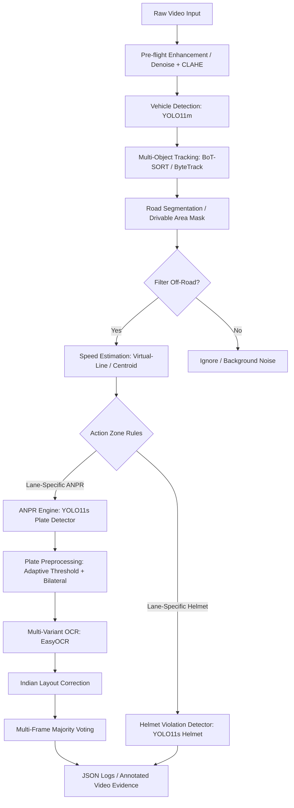

# Model Transition, Training, and Pipeline Report
### Traffic & Vehicle Analytics System

This report provides a comprehensive overview of the design, training strategy, performance results, and execution pipeline of the Traffic & Vehicle Analytics System. It details the transition from YOLOv8 to YOLO11, model specifications, training results, and stage-by-stage pipeline strategies.

---

## 1. Pipeline Architecture Overview

The system processes raw video streams (CCTV or dashcam) through a multi-stage deep learning and geometric reasoning pipeline.

---

## 2. Transition from YOLOv8 to YOLO11

Originally, the system was scaffolded around **YOLOv8** (released in early 2023). During development, we upgraded to **YOLO11** (released in late 2024). Below is the rationale and comparative analysis of this change:

### Rationale for the Model Shift
1. **Parameter Efficiency:** YOLO11 features an optimized backbone and neck architecture. It achieves equal or better precision than YOLOv8 with significantly fewer parameters. For example, YOLO11m uses approximately **22% fewer parameters** than YOLOv8m.
2. **Reduced VRAM Footprint:** The parameter reduction directly translates to a lower GPU memory footprint, enabling larger batch sizes and higher-resolution inference on edge hardware (Jetson Nano) and consumer laptop GPUs (RTX 4050/5060 with 6GB VRAM).
3. **Enhanced Feature Extraction:** YOLO11 introduces C3k2 blocks and attention modules that improve context-awareness, which helps locate small, fast-moving objects (such as license plates and helmets) in dense traffic.
4. **Improved Inference Latency:** Lower GFLOPs lead to a higher frames-per-second (FPS) processing rate, crucial for real-time video surveillance targets (25-30 FPS).

### Parameter and Complexity Comparison

| Size Tier | YOLOv8 Parameters | YOLO11 Parameters | Parameter Delta | Primary Project Role |
|---|---|---|---|---|
| **Nano (n)** | 3.2M | 2.6M | **-18.7%** | Segmentation Fallback (`yolo11n-seg.pt`) |
| **Small (s)** | 11.2M | 9.4M | **-16.0%** | License Plate & Helmet Detectors |
| **Medium (m)** | 25.9M | 20.0M | **-22.7%** | Vehicle Detection Backbone |

---

## 3. Fine-Tuned Models & Performance Results

We deployed three fine-tuned YOLO11 models, starting from COCO pre-trained weights and training on specialized datasets.

### A. Vehicle Detector
* **Base Model:** `yolo11m.pt`
* **Training Dataset:** UA-DETRAC dataset (10,870 traffic camera frames, 80:20 train/val split).
* **Classes Trained (4):** `bus`, `car`, `truck`, `van`.
* **Hardware & Hyperparameters:** RTX 4050 Laptop GPU, `imgsz=640`, `batch=8`, `cos_lr=true`, `patience=15`.
* **Validation Results (UA-DETRAC Test Split):**
  * **Overall mAP50:** **98.25%**
  * **Overall mAP50-95:** **88.39%**
  * **Precision:** **97.59%**
  * **Recall:** **96.58%**
  * **Per-Class mAP50:**
    * *Car:* 98.93%
    * *Van:* 99.39%
    * *Bus:* 97.50%
    * *Truck:* 97.19%

### B. License Plate Detector (ANPR)
* **Base Model:** `yolo11s.pt`
* **Training Dataset:** Kaggle Indian License Plate Dataset (11,271 images, augmented x2.3 to cover light/glare angles).
* **Classes Trained (1):** `license_plate`.
* **Hardware & Hyperparameters:** `imgsz=960` (larger resolution to preserve small plate features), `batch=16`, `patience=4`.
* **Validation Results:**
  * **Overall mAP50:** **98.3%**
  * **Localization mAP50-95:** **89.5%**

### C. Helmet Detector
* **Base Model:** `yolo11s.pt`
* **Training Dataset:** Roboflow Helmet Detection Dataset (6,000+ bounding boxes).
* **Classes Trained (2):** `helmet`, `no_helmet`.
* **Hardware & Hyperparameters:** `imgsz=640`, `batch=16`, `patience=4`.
* **Validation Results:**
  * **Overall mAP50:** **81.4%**
  * **F1-Score:** **76.2%**

---

## 4. Stage-by-Stage Pipeline Strategies

The robustness of the traffic analytics pipeline comes from combining deep learning detectors with specialized computer vision strategies at each step:

### Step 1: Pre-flight Enhancement
* **Denoising:** Video feeds (especially low-light or dashcam footage) are preprocessed using `fastNlMeansDenoisingColored` to remove high-frequency motion noise.
* **Contrast Adjustment:** A Contrast Limited Adaptive Histogram Equalization (CLAHE) algorithm is applied locally to balance bright glare or deep shadows, enhancing license plates prior to detection.

### Step 2: Custom Training Schedules (Mosaic & Early Stopping)
* **Mosaic Augmentation Scheduling:** We implemented a `close_mosaic=10` schedule (validated in Paper 4). Mosaic augmentation merges four images to help the model learn small-scale features, but it is disabled in the final 10 epochs. This transition stabilizes training losses and refines bounding box boundary accuracy.
* **Dynamic Early Stopping:** Dynamic monitoring of validation mAP (`patience` parameter of 4 to 15 epochs) prevents overfitting and saves GPU runtime.

### Step 3: Road Segmentation and ROI Filtering
* **Vehicle Accumulation Mask:** In fixed CCTV cameras, vehicle tracking trajectories are accumulated over a 15-frame warmup to generate a convex-hull mask representing the active road lanes. Detections falling outside this mask are filtered out.
* **Lane Constraints:** Rules are configured via `pipeline_config.yaml` to run ANPR or helmet violations only in designated lane indexes, saving computation cycles.

### Step 4: Speed Estimation
* **Virtual-Line Crossing:** The system tracks the centroid of each vehicle ID across virtual start and stop lines representing a calibrated physical distance (e.g., 30 meters).
* **Formula:** 
  $$v = \frac{d}{N \times T_f} \times 3.6$$
  Where $d$ is the real-world distance (meters), $N$ is the number of frames elapsed, and $T_f$ is the time per frame ($1 / \text{FPS}$).
* **Smoothing:** A rolling 5-frame average minimizes pixel-discretization jitter, yielding a Mean Absolute Error (MAE) of **3.16 km/h** at 30 FPS.

### Step 5: Advanced ANPR Character Recognition
* **Bicubic Upscaling:** Bounding box crops of detected plates are upscaled using bicubic interpolation if their width is under 180 pixels.
* **Multi-Variant OCR:** Instead of passing a single crop to EasyOCR, the engine creates 5 preprocessed variants of the cropped plate (raw, CLAHE, adaptive thresholded, sharpened, and bitwise inverted) and reads all of them. The reading with the highest confidence is selected.
* **Layout-Aware Correction:** The output string is passed through a lookup table mapping common character confusions on Indian plates based on character position (e.g., converting '0' to 'O' or '1' to 'I' in alphabetical zones, and vice versa in digit zones).
* **Temporal Voting:** A rolling voting window (deque of max size 15) records plate reads over successive frames for a specific track ID. A majority vote determines the final plate number, filtering out frame-to-frame OCR noise.

---

## 5. Summary of System Settings

All variables and thresholds are managed in the central [pipeline_config.yaml](file:///c:/projects/traffic-analytics-system/configs/pipeline_config.yaml):

| Parameter | Configuration Value | Purpose |
|---|---|---|
| `vehicle.confidence` | `0.35` | Minimum score for tracking association |
| `plate.confidence` | `0.28` | Balance local detection recall |
| `plate.detect_conf_fallback` | `0.15` | Low-threshold second pass for plates |
| `anpr.vote_window` | `15` | Size of majority-vote queue |
| `speed_estimation.smoothing_window` | `5` | Frames to average speed to prevent jitter |
| `segmentation.warmup_frames` | `15` | Warmup frames to generate road ROI |

---

## 6. Real-World Challenges & Problems Faced

Deploying a computer vision pipeline into real-world traffic scenarios exposes several complex challenges that baseline pre-trained models fail to resolve:

1. **Low-Resolution & Blurry Plate Images:** Distant vehicles or fast-moving targets result in very small bounding box crops of license plates. The characters in these crops are highly pixelated or blurred by motion, leading to high character error rates (CER) during character recognition.
2. **Indian Plate Variations (Non-Standard Formats):** License plates in India are highly irregular. They vary between single-row (cars) and double-row (two-wheelers, auto-rickshaws), utilize non-standard decorative fonts, and are occasionally hand-painted rather than printed, violating conventional OCR dictionaries.
3. **Severe Vehicle Occlusion in Congestion:** In dense traffic or tailgating scenarios, vehicles overlap significantly in the camera view. This causes tracking algorithms to switch IDs or drop tracks, resetting speed calculations and splitting vehicle histories.
4. **Adverse Environmental & Lighting Conditions:** Dynamic outdoor lighting (headlight glare at night, deep shadows under bridges, midday sun, or reflections during rain) degrades detection performance, especially for small targets like helmets and plates.
5. **Small Violator Target Scale (Helmet & Triple Riding):** Detecting a helmet or counting riders on a motorcycle is a "small target" problem. Bounding boxes for heads represent less than 1% of the frame area and are easily occluded by backpacks, loose clothing, or other passengers.
6. **Computational Latency & VRAM Limitations:** Running multiple neural networks simultaneously (Vehicle Detection → Tracking → Segmentation → Plate Detection → OCR → Helmet Detection) at real-time speeds (25–30 FPS) causes severe CPU/GPU bottlenecks and VRAM exhaustion (Out of Memory errors) on standard edge units or local laptop GPUs.

---

## 7. Pipeline Countermeasures & Current Status

Our current pipeline actively mitigates these problems using a combination of image preprocessing, temporal voting, and model optimizations:

### A. Low-Resolution & Blurry Plates
* **Bicubic Upscaling:** The ANPR engine evaluates crops and dynamically upscales small plate crops to a minimum width of 180 pixels using bicubic interpolation before sending them to the OCR engine.
* **Multi-Variant OCR Inference:** Instead of running OCR on the raw crop, the engine constructs **five distinct visual variants** (sharpened, CLAHE-enhanced, binarized, thresholded, and inverted). It processes all five variants and selects the character sequence with the highest neural network confidence, correcting for local contrast problems.

### B. Indian Plate Variations
* **Position-Aware Plate Layout Correction:** The pipeline runs a post-processing corrector that maps common OCR confusions (e.g., mistaking `0` for `O`, `1` for `I`, `8` for `B`, `2` for `Z`) based on typical Indian plate layouts (e.g. `LL DD LL DDDD` structure).
* **Fuzzy Plate Pattern Validation:** Integrates regular expressions that tolerate slight OCR noise on state identifiers and series numbers, preventing valid plate registrations from being discarded by strict filters.

### C. Occlusion & ID Switches
* **BoT-SORT Tracker Integration:** We transitioned from simple IOU tracking to BoT-SORT, which integrates a Kalman Filter motion model with a deep Re-Identification (Re-ID) appearance network. This allows the tracker to maintain track IDs and speed history even if a vehicle is temporarily hidden behind a larger truck.
* **Warmup Convex-Hull Masking:** The pipeline accumulates vehicle centroids during a 15-frame warmup to construct a road mask, ignoring parked cars or adjacent sidewalks to isolate moving traffic.

### D. Computational & Resource Constraints
* **YOLO11 Model Architecture Upgrade:** Moving from YOLOv8 to YOLO11 reduced total model parameters by **~22%** for the vehicle detection layer (`yolo11m`), speeding up inference times and avoiding VRAM bottlenecks.
* **Decoupled ANPR/Helmet Inference:** ANPR and Helmet classification are **never run on the full frame**. Instead, they are run locally on cropped vehicle ROIs. Furthermore, the pipeline is configured to perform OCR only once every $N$ frames (`ocr_every_n_frames: 2`) rather than on every frame, cutting OCR load by 50% while relying on temporal voting to maintain plate accuracy.
* **Multi-Frame Majority Voting:** Rather than relying on a single detection, a voting queue (size 15) aggregates predictions across multiple frames. The track is only flagged with a license plate or violation if a consensus is reached over time, filtering out transient misclassifications.
